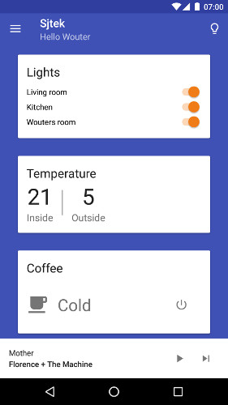

# Sjtek client for Android

An Android app for the SjtekControl Core home automation API.

## Downloads
[Latest version from Jenkins](https://jenkins.habets.io/job/Sjtek/job/sjtekclient-android/job/master/lastSuccessfulBuild/artifact/app/build/outputs/apk/app-release-unsigned.apk).

## Screenshots
[Go to the screenshots folder for more](/screenshots/README.md)

## Documentation
Most of the classes contain some Javadocs. Additional dutch documentation can be found in the [docs](./docs/README.md) folder.