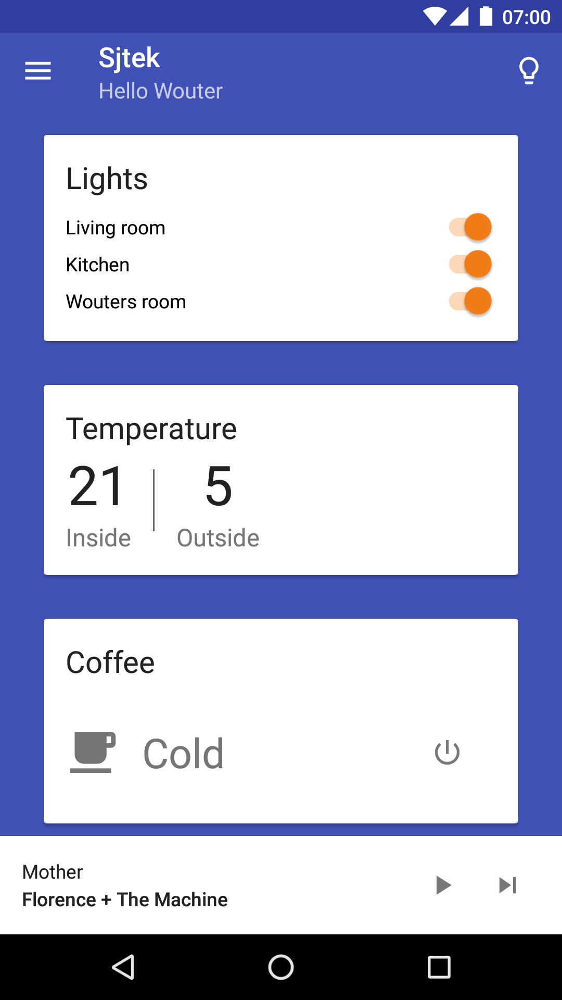
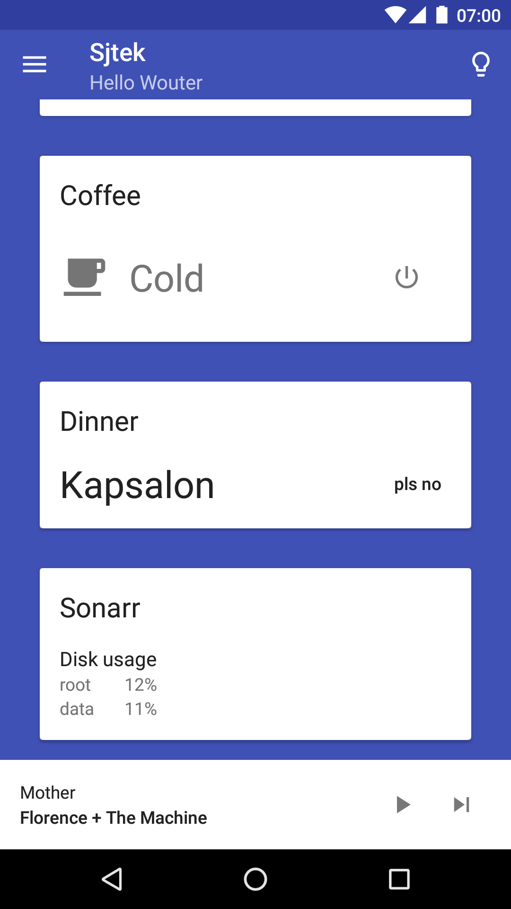
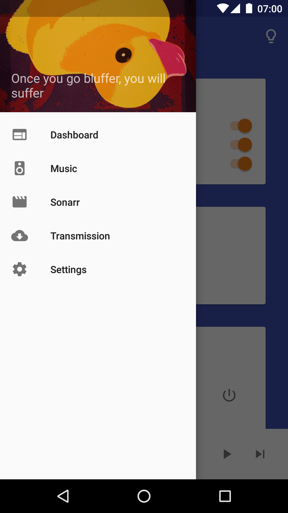
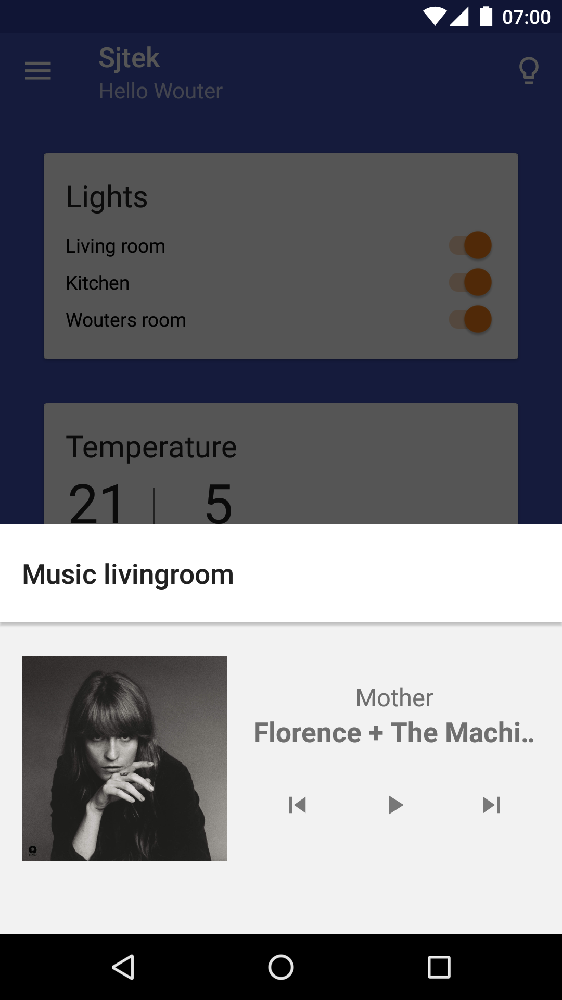
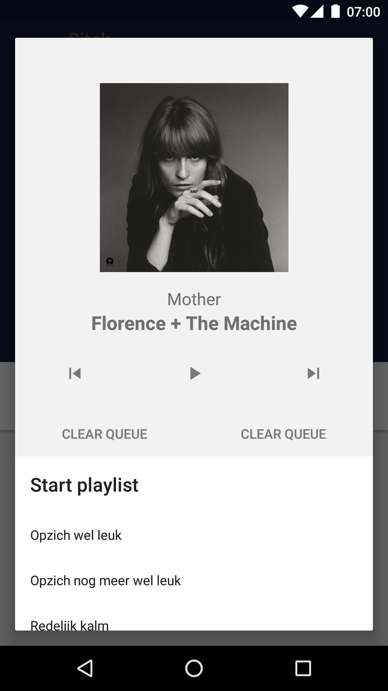
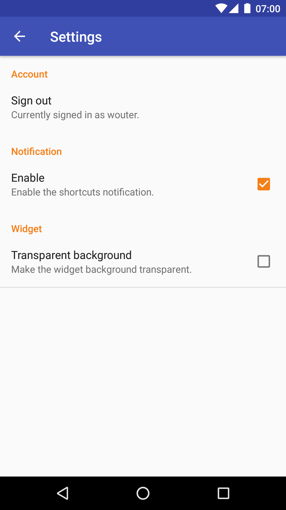
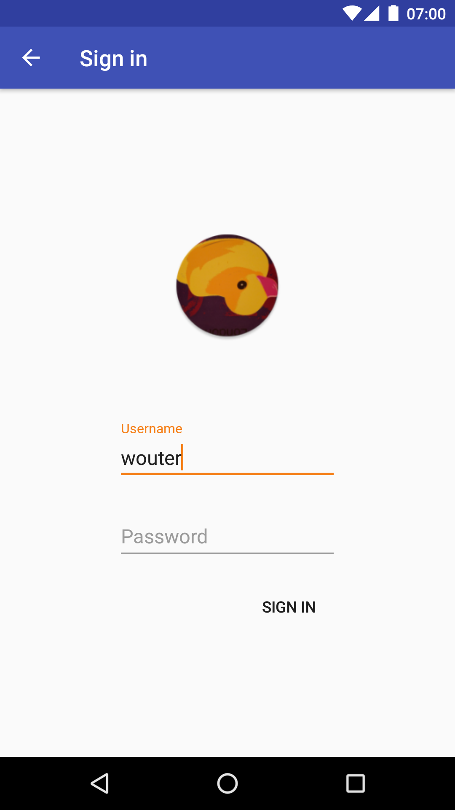

# Sjtek - Screenshots

## Dashboard
This main activity contains various cards for controlling stuff in the house.

## Music
On the bottom of the app, a sheet is available to control the music.
After tapping the playlist button, a dialog will appear to start a playlist.

## Settings
Settings activity.

